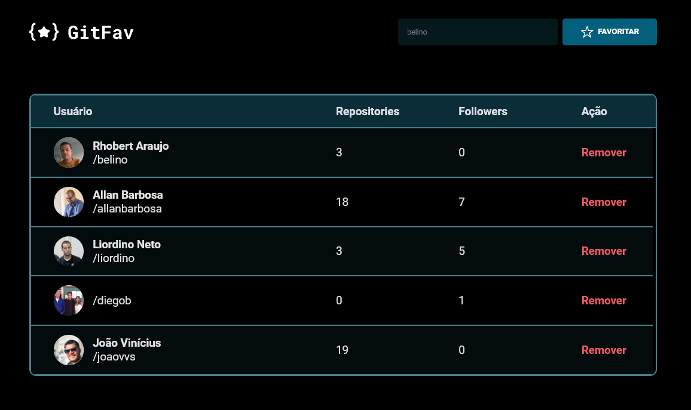

#  

Projeto para resolução de desafio proposto no módulo "Stage-06" do curso Explorer da rocketseat.

## Sobre o desafio

O desafio consiste na criação de uma lista para favoritar perfis do github.

## Preview 

## Aprendizados

- Conceitos de SPA;
- Assíncrono e promises;
- Orientação a objetos;
- Classes e muito mais.

## Stack utilizada

**Front-end:** JavaScript, HTML e CSS

